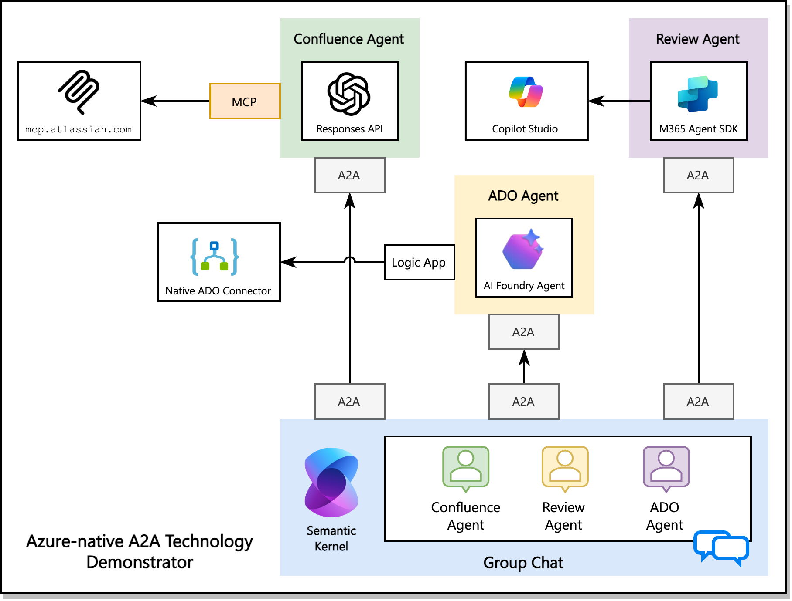
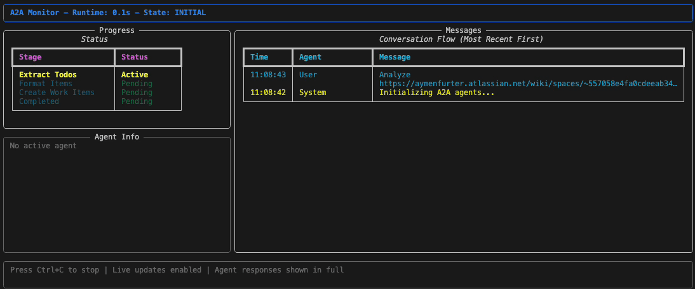

<div align="center">

# Azure A2A Demo

*Azure-native A2A Technology Demonstrator*

[](https://opensource.org/licenses/MIT)  [](https://www.python.org/downloads/)  [](https://azure.microsoft.com/en-us/products/ai-foundry)  [](https://learn.microsoft.com/en-us/azure/ai-foundry/openai/how-to/responses)  [](https://azure.microsoft.com/en-us/products/devops)



</div>


## Overview

This repository is a **technology demonstrator** showcasing the implementation of two protocols for AI agent collaboration: the **Agent2Agent (A2A) protocol** and the **Model Context Protocol (MCP)**.

**What are these protocols?**
- The **Model Context Protocol (MCP)** is a well-established standard created by Anthropic that defines communication between AI agents and tools/data sources. It's widely adopted across AI development tools including GitHub Copilot, Cursor, and Microsoft's ecosystem.
- The **Agent2Agent (A2A) protocol** is an emerging open standard hosted by the Linux Foundation that aims to enable collaboration between AI agents across different platforms, vendors, and technologies. While promising, it's still in early stages of adoption.

**What this demonstration shows:**
This project illustrates how to build agents using Microsoft's ecosystem - Azure AI Foundry, Copilot Studio and Semantic Kernel - while integrating external data sources through MCP and exploring A2A for agent-to-agent communication. The result is a practical example of assembling AI agents that can work together, though with varying levels of protocol maturity and support.

Rather than building monolithic AI solutions, this approach demonstrates how specialized agents can be composed to create collaborative AI workflows, with MCP providing mature tool integration and A2A showing the future potential for agent interoperability.

### Key Features

- **Multi-Agent Orchestration** - Coordinate multiple remote agents in a group chat.
- **Remote MCP Server** - Connect to external data sources through MCP protocol, with Confluence serving as an example.
- **User Story Formatting** - Transform raw requirements into well-structured Azure DevOps work items
- **UI** - Terminal-based interface for progress visualization
- **Modular Architecture** - Easy to extend with new agents and capabilities

### Group Chat Demo



The group chat orchestrator automatically:

1. **Extracts** todos from Confluence pages
2. **Formats** them into structured work items
3. **Creates** Azure DevOps work items

## Architecture

### Agents

| Agent | Purpose | Technology | Port |
|-------|---------|------------|------|
| **Confluence Agent** | Extract todos from Confluence pages | Azure OpenAI + MCP | 8002 |
| **Formatter Agent** | Structure work items with acceptance criteria | Copilot Studio | 8000 |
| **DevOps Agent** | Create Azure DevOps work items | Azure AI + Logic Apps | 8001 |

## Usage

### Start Individual Agents

```bash
cd confluence_agent && python main.py # for all agents
cd group_chat && python main.py # seperate terminal
```

## Protocol Support & Maturity

> [!NOTE]  
> **Disclaimer:** The assessments and recommendations below reflect personal opinions based on current observations of the technology landscape and should not be considered official Microsoft guidance.

### Current Support Matrix (As per July 2025)

| Platform | MCP Support | A2A Support | Notes |
|----------|-------------|-------------|-------|
| **[Azure AI Foundry Agents](https://learn.microsoft.com/en-us/azure/ai-foundry/agents/how-to/tools/model-context-protocol-samples)** | Available | [Announced](https://azure.microsoft.com/en-us/blog/azure-ai-foundry-your-ai-app-and-agent-factory/) | MCP support in preview, A2A support announced at Build |
| **[Copilot Studio](https://learn.microsoft.com/en-us/microsoft-copilot-studio/agent-extend-action-mcp)** | Available/OAS | [Announced](https://www.microsoft.com/en-us/microsoft-copilot/blog/copilot-studio/whats-new-in-copilot-studio-may-2025/) | MCP via OpenAPI connector |
| **[Semantic Kernel](https://devblogs.microsoft.com/semantic-kernel/integrating-model-context-protocol-tools-with-semantic-kernel-a-step-by-step-guide/)** | Available | [.NET Only](https://devblogs.microsoft.com/foundry/semantic-kernel-a2a-integration/) | A2A support limited to .NET stack |
| **[Azure OpenAI Responses API](https://learn.microsoft.com/en-us/azure/ai-foundry/openai/how-to/responses?tabs=python-secure)** | Available | ❌ | MCP through tool calling capabilities |

### Protocol Maturity

**Model Context Protocol (MCP)**
- ✅ **Relatively mature to be considered** for production use
- ✅ Super popular, wide ecosystem support (specifically across AI development tools)
- ✅ Security patterns emerging
- ✅ Supported in Azure API Management and API Center for governance
- ⚠️ **Security consideration**: Review MCP servers from unknown sources carefully

**Agent2Agent (A2A)**
- 🔄 **Early stage** - evaluate regularly as support evolves
- 🔄 Limited platform integration currently available
- 🔄 Additional complexity may outweigh benefits for single-team projects
- ✅ **Future potential** for true cross-platform agent interoperability
- 📋 **Recommendation**: Consider for multi-team scenarios with different tech stacks or heterogeneous AI Agent stacks

### Usage Recommendations

**Choose MCP when:**
- Building tools for AI agents to consume
- Want to future-proof tool investments
- Foster reuse of tools across AI agents

**Consider A2A when:**
- Multiple teams building agents on different platforms
- Long-term interoperability is critical
- You can accept additional implementation complexity
- Building agents that need to discover and communicate with each other

**Security Best Practices:**
- Use [Azure AI Gateway patterns](https://github.com/Azure-Samples/AI-Gateway/tree/main/labs/mcp-a2a-agents) for securing MCP servers
- Deploy MCP servers in Azure Container Apps for isolation
- Implement additional authorization layers (Often MCP servers require additional authorization)
- Maintain inventory of MCP servers using [Azure API Center](https://learn.microsoft.com/en-us/azure/api-center/register-discover-mcp-server)

## References

This project is built on top of several cutting-edge technologies and frameworks:

### Core Technologies
- **[A2A Protocol](https://github.com/a2aproject/A2A)** - Agent-to-Agent communication protocol and framework
- **[Model Context Protocol (MCP)](https://modelcontextprotocol.io/)** - Standardized protocol for AI model-context integration
- **[Semantic Kernel](https://learn.microsoft.com/en-us/semantic-kernel/overview/)** - Microsoft's SDK for integrating AI services with conventional programming languages

### Azure AI Services
- **[Azure AI Foundry Agents](https://learn.microsoft.com/en-us/azure/ai-foundry/agents/overview)** - Managed agent infrastructure and deployment
- **[Azure OpenAI Responses API](https://learn.microsoft.com/en-us/azure/ai-foundry/openai/how-to/responses?tabs=python-secure)** - Enhanced OpenAI API with tool calling capabilities
- **[Azure Logic Apps](https://learn.microsoft.com/en-us/azure/logic-apps/logic-apps-overview)** - Cloud-based workflow automation and integration

### Integration Platforms
- **[Atlassian MCP Integration](https://www.atlassian.com/blog/announcements/remote-mcp-server)** - Remote MCP server for Confluence and Jira integration
- **Microsoft Copilot Studio** - Low-code platform for building conversational AI agents

## License

This project is licensed under the MIT License
see the [LICENSE](LICENSE) file for details.

<div align="center">

**[⭐ Star this repo](https://github.com/aymenfurter/a2a)** • **[🐛 Report Bug](https://github.com/aymenfurter/a2a/issues)** • **[💡 Request Feature](https://github.com/aymenfurter/a2a/issues)**

*Built with ❤️ to avoid tomorrow's technical debt through standardized protocols*

</div>
