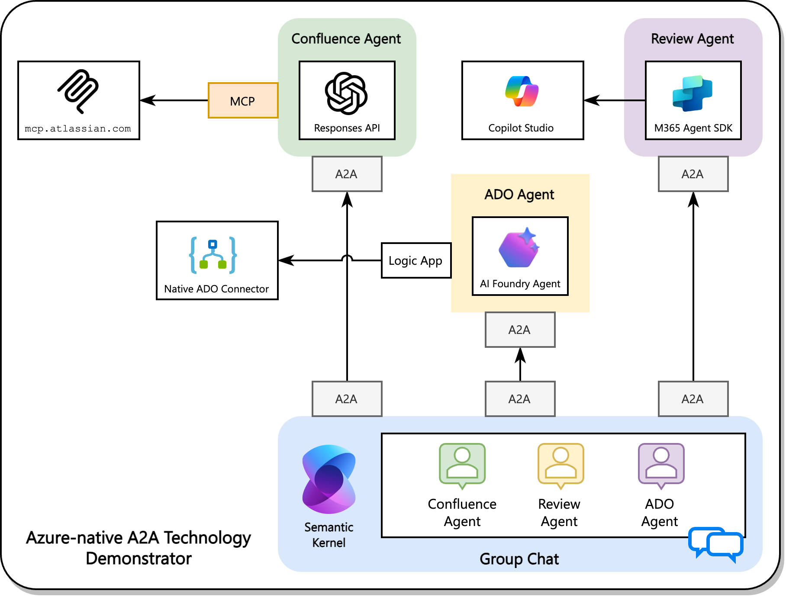

<div align="center">

# 🤖 A2A - Agent-to-Agent Communication Framework

*Orchestrating intelligent workflows through seamless multi-agent collaboration*

[](https://opensource.org/licenses/MIT)
[](https://www.python.org/downloads/)
[](https://azure.microsoft.com/en-us/products/ai-foundry)
[](https://learn.microsoft.com/en-us/azure/ai-foundry/openai/how-to/responses)
[](https://azure.microsoft.com/en-us/products/devops)



</div>

## 🎯 Overview

This repository is a **technology demonstrator** showcasing the implementation of two protocols for AI agent collaboration: the **Agent2Agent (A2A) protocol** and the **Model Context Protocol (MCP)**.

**What are these protocols?**
- The **A2A protocol** is an open standard hosted by the Linux Foundation that enables collaboration between AI agents across different platforms, vendors, and technologies
- The **Model Context Protocol (MCP)** standardizes how applications provide context to LLMs, acting like a universal connector between AI models and various data sources

**What this demonstration shows:**
This project illustrates how to build A2A-compliant agents using Microsoft's ecosystem - Azure AI Foundry, Copilot Studio and Semantic Kernel - while integrating external data sources through MCP. The result is a practical example of assembling a collaborative team of AI agents, each leveraging different Microsoft Cloud capabilities to work together on complex enterprise workflows.

Rather than building monolithic AI solutions, this approach demonstrates how specialized agents can be orchestrated to create a truly collaborative AI agent ecosystem where each agent contributes its unique strengths to solve complex business problems.

### 🌟 Key Features

- 🔄 **Multi-Agent Orchestration** - Coordinate multiple remote agents in a group chat.
- 📋 **Remote MCP Server** - Connect to external data sources through MCP protocol, with Confluence serving as an example.
- 🎯 **User Story Formatting** - Transform raw requirements into well-structured Azure DevOps work items
- 🖥️ **UI** - Terminal-based interface for progress visualization
- 🔧 **Modular Architecture** - Easy to extend with new agents and capabilities

## 🏗️ Architecture

### 🤖 Agent Ecosystem

| Agent | Purpose | Technology | Port |
|-------|---------|------------|------|
| **Confluence Agent** | 📚 Extract todos from Confluence pages | Azure OpenAI + MCP | 8002 |
| **Formatter Agent** | ✨ Structure work items with acceptance criteria | Copilot Studio | 8000 |
| **DevOps Agent** | 🔧 Create Azure DevOps work items | Azure AI + Logic Apps | 8001 |

## 🎬 Usage

### Start Individual Agents

```bash
(cd confluence_agent && python main.py &) && (cd devops_agent && python main.py &) && (cd userstory-format-agent && python main.py &)
cd group_chat && python main.py # seperate terminal
```

### 🎭 Group Chat Demo


The group chat orchestrator automatically:

1. 📖 **Extracts** todos from Confluence pages
2. ✨ **Formats** them into structured work items
3. 🔧 **Creates** Azure DevOps work items

## 📚 References

This project is built on top of several cutting-edge technologies and frameworks:

### Core Technologies
- **[A2A Protocol](https://github.com/a2aproject/A2A)** - Agent-to-Agent communication protocol and framework
- **[Model Context Protocol (MCP)](https://modelcontextprotocol.io/)** - Standardized protocol for AI model-context integration
- **[Semantic Kernel](https://learn.microsoft.com/en-us/semantic-kernel/overview/)** - Microsoft's SDK for integrating AI services with conventional programming languages

### Azure AI Services
- **[Azure AI Foundry Agents](https://learn.microsoft.com/en-us/azure/ai-foundry/agents/overview)** - Managed agent infrastructure and deployment
- **[Azure OpenAI Responses API](https://learn.microsoft.com/en-us/azure/ai-foundry/openai/how-to/responses?tabs=python-secure)** - Enhanced OpenAI API with tool calling capabilities
- **[Azure Logic Apps](https://learn.microsoft.com/en-us/azure/logic-apps/logic-apps-overview)** - Cloud-based workflow automation and integration

### Integration Platforms
- **[Atlassian MCP Integration](https://www.atlassian.com/blog/announcements/remote-mcp-server)** - Remote MCP server for Confluence and Jira integration
- **Microsoft Copilot Studio** - Low-code platform for building conversational AI agents

## 🤝 Contributing

We welcome contributions! Please see our [Contributing Guide](CONTRIBUTING.md) for details.

1. 🍴 Fork the repository
2. 🌿 Create a feature branch
3. 💾 Commit your changes
4. 📤 Push to the branch
5. 🎯 Create a Pull Request

## 📄 License

This project is licensed under the MIT License - see the [LICENSE](LICENSE) file for details.

## 🙏 Acknowledgments

- 🤖 **[Azure AI Foundry](https://azure.microsoft.com/en-us/products/ai-foundry)** for agent infrastructure and deployment platform
- 📋 **[Atlassian MCP](https://www.atlassian.com/blog/announcements/remote-mcp-server)** for Confluence integration capabilities
- ⚙️ **[Azure Logic Apps](https://learn.microsoft.com/en-us/azure/logic-apps/logic-apps-overview)** for DevOps workflow automation
- 🎨 **[Rich](https://rich.readthedocs.io/)** for beautiful terminal interfaces
- 🔗 **[A2A Project](https://github.com/a2aproject/A2A)** for the foundational agent communication protocol
- 🧠 **[Semantic Kernel](https://learn.microsoft.com/en-us/semantic-kernel/overview/)** for AI orchestration framework
- 🌐 **[Model Context Protocol](https://modelcontextprotocol.io/)** for standardized AI-context integration

---

<div align="center">

**[⭐ Star this repo](https://github.com/aymenfurter/a2a)** • **[🐛 Report Bug](https://github.com/aymenfurter/a2a/issues)** • **[💡 Request Feature](https://github.com/aymenfurter/a2a/issues)**

*Built with ❤️ to avoid tomorrow's technical debt through standardized protocols*

</div>
